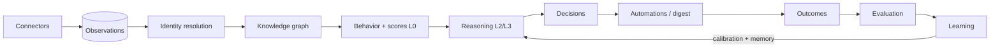

# GTM Intelligence Engine

**Answers one question, weekly: who should you talk to — and why.**

Pipe in the audience data you already have (CRM export, GitHub, newsletter, payments, website, any webhook). The engine resolves fragmented identities into people, scores buying intent with explainable factors, reasons over the aggregates, and hands you a ranked outreach list plus one recommendation — with evidence, a reasoning trace, a confidence number, and a memory of what worked last time.

[](https://github.com/anishgupta-global/gtm-intelligence-engine/actions)
[](LICENSE)


**▶ Live demo:** https://anishgupta-global.github.io/gtm-intelligence-engine/ — the dashboard over a snapshot of the demo pipeline (fictional dataset, no signup).

## The Intelligence Law

> **No AI output may exist without evidence, provenance, confidence, cost, and reproducibility.**

Every module obeys it: every enrichment, score, and recommendation records *which observations* support it, *what produced it* (model + version), *how sure it is*, *what it cost*, and *how to regenerate it* (input hash + data version). Evidence IDs are joined from the database — they physically cannot be hallucinated.



## Why this is different

- **A decision loop, not a dashboard.** Every recommendation is a first-class decision object with a lifecycle: proposed → accepted → executed → **outcome measured** → **evaluated (expected vs actual)** → **learned from**. The next similar decision carries the prior: *"86% similar to a past winner."*
- **Cost efficiency is the architecture, not a setting.** Work routes through a cost pyramid — L0 rules/SQL (free) → L1 local embeddings (free) → L2 small LLM → L3 large LLM. Target distribution ≥70% at L0, enforced by a CI-tested fixture. LLMs receive ~50 aggregate numbers, never raw records. Cost per insight is a first-class KPI.
- **Identity you can trust — and undo.** A person is a *virtual cluster* of identifiers held by evidence-backed membership rows. Deterministic matches merge automatically; probabilistic matches (0.70–0.90) wait in a human review queue; merges are reversible by construction. Two "Alex Kumar"s at different companies stay two people.
- **$0 by default.** A grounded mock provider runs the entire loop without any API key. Set `ANTHROPIC_API_KEY` and the same pipeline uses Claude (small model for classification, large for reasoning) under a monthly budget that degrades gracefully — never silently overspends.
- **GDPR from day one.** Consent basis on every observation, PII redaction before any LLM call, DSAR export and erasure endpoints (payload hard-delete + tombstone).

## Quickstart (2 minutes, zero config, zero cost)

Requires Node ≥ 22.13 (SQLite is built into Node — no Docker, no native builds).

```bash
git clone https://github.com/anishgupta-global/gtm-intelligence-engine.git
cd gtm-intelligence-engine
npm install
npm run demo     # full engine walkthrough on a fictional dataset (Northwind AI)
npm run dev      # dashboard + API at http://localhost:4100
```

`npm run demo` walks the whole loop and narrates it: 5 connectors ingest 37 observations → identity resolution (one cross-source merge, one adversarial non-merge, one human-review case) → hot leads with evidence → a recommendation with a full reasoning trace → outcome recorded → evaluation (winner) → calibration learned → week-2 data arrives → the next recommendation cites the memory prior → re-run with no new data reuses the decision (zero spend) → DSAR export + erasure. The weekly digest lands in `data/digest.md`.

Turn on real reasoning (optional):

```bash
# .env
ANTHROPIC_API_KEY=sk-ant-...
ANTHROPIC_MODEL=claude-haiku-4-5        # L2 classification
ANTHROPIC_SMART_MODEL=claude-sonnet-5   # L3 reasoning
AI_MONTHLY_BUDGET_USD=15
```

## Connect your own data

**Universal webhook** (works with Zapier/Make/n8n → 5,000+ tools):

```bash
curl -X POST http://localhost:4100/api/ingest/webhook/my-source \
  -H "content-type: application/json" \
  -d '{"signalType":"pricing_view","externalId":"ev-1","observedAt":"2026-07-25T09:00:00Z","actor":{"email":"jane@acme.com","name":"Jane Doe","company":"Acme"},"props":{"path":"/pricing"}}'
curl -X POST http://localhost:4100/api/pipeline/run
```

**CSV import**: export contacts from any CRM into `data/fixtures/crm.csv`'s shape.
**Native connectors**: GitHub (official API — set `GITHUB_REPO=owner/repo` for live stargazers), plus fixture-based connectors for newsletter/website/payments that show exactly what a real one returns. A connector is ~20 lines against the SDK (`src/connectors/sdk.ts`) — it maps source data to typed signals from the [signal registry](docs/SIGNALS.md) and never touches anything downstream.

## API

| Endpoint | Purpose |
| --- | --- |
| `GET /api/summary` · `/api/leads/hot` · `/api/leads/fading` | KPIs, segment momentum, ranked leads with evidence |
| `GET /api/people` · `/api/people/:id` | Resolved people; full profile with memberships, observations, edges, scores, enrichments |
| `GET /api/review-queue` · `POST .../approve` · `POST .../reject` | Human review of probabilistic identity merges |
| `GET /api/decisions` · `POST /api/decisions/:id/accept·dismiss·outcome` | Decision lifecycle — recording an outcome triggers evaluation + learning |
| `GET /api/evaluation` | Expected vs actual, acceptance/success rates, calibration error |
| `GET /api/cost` | Budget state, level distribution, cache hits, **cost per insight** |
| `GET /api/digest` | The weekly GTM digest (markdown) |
| `POST /api/ingest/webhook/:source` · `POST /api/pipeline/run` | Ingestion + pipeline trigger |
| `GET /api/privacy/persons/:id/export` · `DELETE /api/persons/:id` | DSAR export / erasure |

Set `API_KEY` in `.env` to require `Authorization: Bearer` on the API.

## Documentation

- [PRD](docs/PRD.md) — vision, wedge, the 12-layer architecture, and the full **audit: 18 loopholes → closures → trade-offs**
- [Engineering principles](docs/ENGINEERING_PRINCIPLES.md) — the 12 rules contributors build by
- [Architecture](docs/ARCHITECTURE.md) — layers, pipeline, data model
- [Signal registry](docs/SIGNALS.md) · [Event catalog](docs/EVENTS.md) · [Evaluation metrics](docs/EVALUATION.md)
- [ADRs](docs/adr) — 12 decision records
- [Threat model](docs/THREAT_MODEL.md) · [SECURITY](SECURITY.md) · [CONTRIBUTING](CONTRIBUTING.md)

## Roadmap

**v1 (this release)** — connectors, identity, scores, reasoning, decision memory, evaluation, learning, weekly digest, dashboard.
**v2** — Postgres/pgvector + multi-tenant RLS, more native connectors (HubSpot, Stripe, Slack live modes), optimization engine (goal → ranked strategy plan), plugin sandbox, real embedding models.
**v3** — autonomous GTM loops, trained prediction models (once outcome history exists), cross-workspace benchmarking.

The v1 rule that keeps scope honest: *if a feature doesn't improve the weekly question — "who should I talk to, and why" — it doesn't ship in v1.*

## License

Apache-2.0 · built by [Anish Gupta](https://anishgupta.eu)
