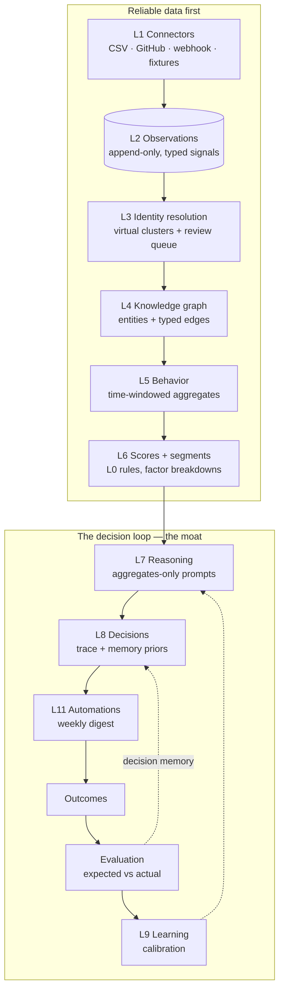
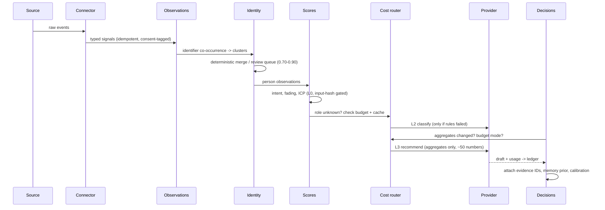

# Architecture

## Layers



## Pipeline sequence



## Data model (SQLite, one file)

| Table | Holds |
| --- | --- |
| `observations` | Append-only typed signals; unique on (tenant, source, external_id, content_hash); consent basis; erasable payloads |
| `identifiers` | Extracted identity claims (email, handle) per observation |
| `persons` + `person_memberships` | Virtual clusters: membership rows carry confidence, method, evidence, engine version, status (active/pending_review/retracted/rejected) |
| `entities` + `edges` | Companies, repos, products, topics; typed edges with provenance and validity |
| `enrichments` | Never overwritten; field, value, confidence, provenance, model, reasoning, resolution level |
| `scores` | Intent / fading / ICP fit with factor JSON and input hash (incremental skip) |
| `decisions` / `outcomes` / `evaluations` / `calibration` | The decision loop: trace, embedding, priors, expected vs actual, verdicts, learned adjustments |
| `intelligence_cache` | AI outputs by input hash + TTL with hit counters |
| `cost_ledger` | Every operation: level, model, tokens, dollars, cache flag |
| `events` / `audit_log` / `sync_state` | Pipeline event log, sensitive-action audit, connector cursors |

## Module map

```
src/
  signals/registry.ts      typed signal catalog (zod) + identifier extraction
  connectors/              sdk (ingest/sync) · csv · github · fixture
  identity/resolve.ts      union-find co-occurrence + probabilistic matching + review queue
  graph/store.ts           entities, edges, person view
  intelligence/            behavior windows · scores (+ role enrichment gating) · segments
  cost/                    router (levels, budget, ledger) · cache
  ai/                      providers (mock $0, anthropic) · aggregates-only prompts
  decisions/               reason (traces, gate) · memory · evaluate · learn
  automations/digest.ts    weekly GTM digest (+ optional Slack)
  privacy/dsar.ts          export + erasure
  pipeline/                run (stage orchestration) · events (log/audit)
  api/server.ts            Fastify REST + static dashboard
web/                       vanilla-JS dashboard (live API or static demo snapshot)
scripts/                   demo, demo-core, build-demo-data
```

## Swap paths (all behind existing interfaces)

- **SQLite → Postgres + pgvector**: `db.ts` and repository functions; RLS enables multi-tenancy (ADR-0004, ADR-0012).
- **Local hash embeddings → real embedding model**: `util.localEmbed` is the single entry point (L1 stays L1).
- **Mock ↔ Anthropic provider**: `ai/provider.ts` interface; any other provider is one class.
- **In-process pipeline → queued workers**: stages are already pure functions over the store; a queue slots between them.
